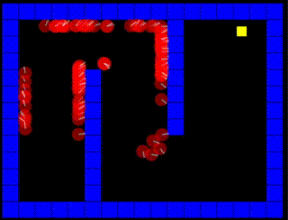

# navgen
The agents learn how to navigate a level using an evolutonary algorithm that
maps each action to their DNA and keeps breeding and testing them indefinitely.
I hacked this together for a lecture I was invited to conduct at Buckswood
School in Tskhneti.

არსებები სწავლობენ მოცემულ გარემოში ნავიგაციას ევოლუციური ალგორითმის
გამოყენებით, რომელიც თავიანთ დნმს შეუსაბამებს თითოეულ მოქმედებას. მივაფუჩეჩე
უცბად რადგან ბაქსვუდის სკოლაში მიმიწვიეს ლექციის ჩასატარებლად ლექციისთვის.



## Running

Requires [Love2D](love2d.org) to run.

```
git clone
cd navgen
love .
```
